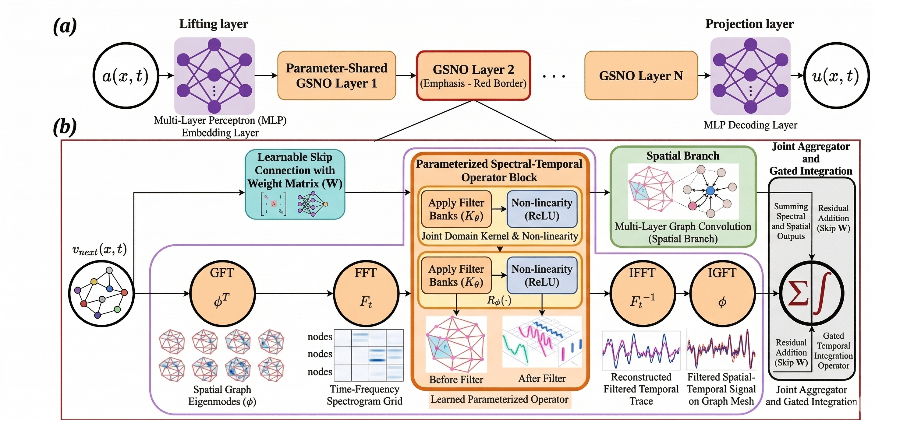
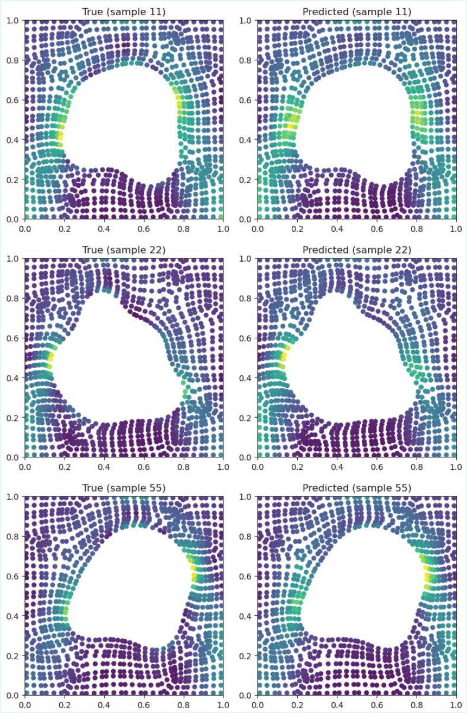
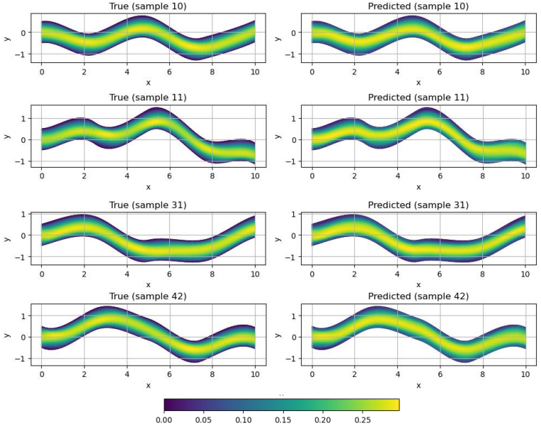
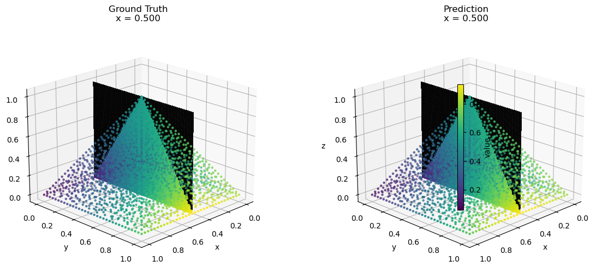

This is an anonymous repository supporting the paper titled *Graph Spectral Neural Operators: Learning Space-Time PDE Solutions on Arbitrary Geometries* for ICM 2026.

---
---

  

  <strong>Figure 1:</strong> Revised schematic of the GSNO architecture.

---
---

# 🟥 Case A: Elasticity

  

  <strong>Figure 2:</strong> Elasticity benchmark setup, where the model predicts the stress field over the domain. Adapted from <a href="https://arxiv.org/html/2207.05209v2"><em>Geometry-Aware Fourier Neural Operator (GEO-FNO)</em></a> by Li et al. (2023).

| Model             | Training Error | Testing Error |
| ----------------- | -------------: | ------------: |
| CORAL             |         0.0925 |        0.1012 |
| Geo-FNO (learned) |         0.0125 |        0.0229 |
| GraphNO           |         0.1271 |        0.1260 |
| MGKN              |         0.0068 |        0.0112 |
| DeepONet          |         0.0528 |        0.0965 |
| AMG               |         0.0063 |        0.0105 |
| GNOT              |         0.0851 |        0.0934 |
| SP2GNO            |         0.0715 |        0.0792 |
| Transolver        |         0.0072 |        0.0121 |
| GSNO              |     **0.0011** |    **0.0013** |

  <strong>Table 1:</strong> Mean squared error (MSE) results for the elasticity benchmark, adapted from <a href="https://arxiv.org/html/2207.05209v2"><em>Fourier Neural Operator with Learned Deformations for PDEs on General Geometries</em></a> by Zongyi Li et al. (2023, p. 14).

---
---

# 🟥 Case B: Pipe Flow

  

  <strong>Figure 3:</strong> Pipe flow benchmark setup, where the model predicts the velocity and pressure fields over the domain. Adapted from <a href="https://arxiv.org/html/2207.05209v2">Geometry-Aware Fourier Neural Operator (GEO-FNO)</a> by Li et al. (2023).

| Model              | Training MSE | Testing MSE  |
| ------------------ | ------------ | ------------ |
| CORAL              | 0.003983     | 0.005690     |
| Geo-FNO            | 0.0047       | 0.0067       |
| MGKN               | 0.001670     | 0.002412     |
| DeepONet           | 0.002558     | 0.003675     |
| AMG                | 0.001590     | 0.002299     |
| GNOT               | 0.003556     | 0.005087     |
| SP2GNO             | 0.002885     | 0.004138     |
| Transolver         | 0.001785     | 0.002576     |
| FNO interpolation  | 0.0083       | 0.0151       |
| UNet interpolation | 0.0109       | 0.0182       |
| GSNO               | **0.000366** | **0.000539** |

  <strong>Table 2:</strong> Mean squared error (MSE) results for the pipe flow benchmark, adapted from <a href="https://arxiv.org/html/2207.05209v2"><em>Fourier Neural Operator with Learned Deformations for PDEs on General Geometries</em></a> by Zongyi Li et al. (2023, p. 18).

---
---

# 🟥 Case C: 3D+t Burgers

  

  <strong>Figure 4:</strong> 3D+T Burgers benchmark (newly added case), where the model predicts the time-dependent velocity field over the domain.

| Model                   | (Relative $L_2$) | Runtime per Epoch (s) |
| ----------------------- | ---------------- | --------------------- |
| CORAL                   | 0.1667           | 3.18                  |
| Geo-FNO                 | 0.1909           | 4.22                  |
| MGKN                    | 0.0818           | 2.71                  |
| DeepONet                | 0.1160           | 2.91                  |
| AMG                     | (0.0786)         | 4.76                  |
| GNOT                    | 0.1519           | 4.08                  |
| SP2GNO                  | 0.1280           | 1.66                  |
| Transolver              | 0.0864           | (1.57)                |
| GSNO                    | **0.0236**       | **1.45**              |
| Promotion (vs 2nd-best) |69.8%↓            |  7.8%↓                |

  <strong>Table 3:</strong> Relative \(L_2\) error and wall-clock time per epoch for the 3D+T Burgers benchmark.

